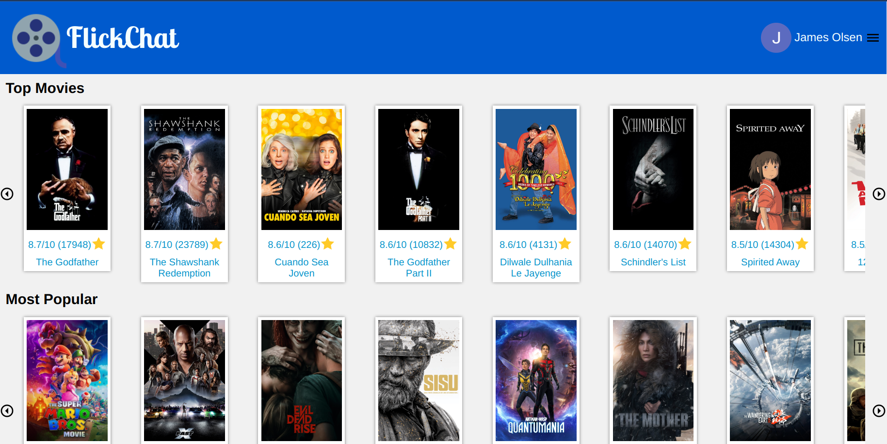
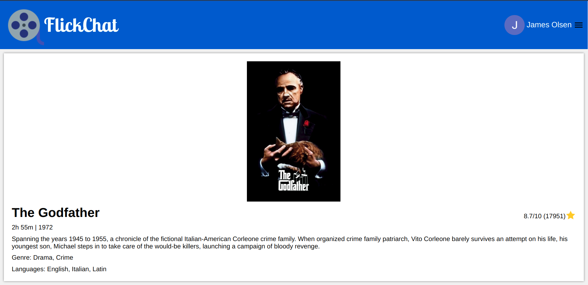
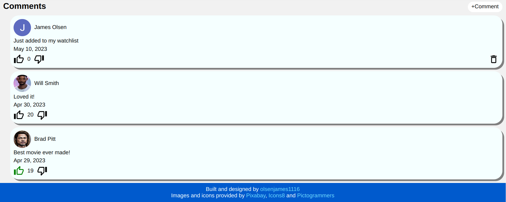

# social-networking-app

## Previews

Home Page:

Movie Data on Movie Page:

Comments on Movie Page:

## Description

A movie blogging app that allows users to comment and interact with comments on some of today's top movies. Read what other people are saying about movies or leave some thoughts of your own. Each comment can be liked or disliked to show the approval of that comment. Each movie page also provides some basic information to keep you up to date on what everyone is watching!

This project highlights:

- React
- OOP
- Hooks
- Redux
- Reading and writing to Firebase
- Database queries
- Async/await
- PropTypes
- Google Auth
- API calls
- Routing
- Conditional rendering
